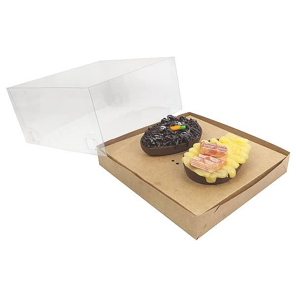

<!--
author:   Andrea Charão

email:    andrea@inf.ufsm.br

version:  0.0.1

language: PT-BR

narrator: Brazilian Portuguese Female

comment:  Material de apoio para a disciplina
          ELC106 - Algoritmo e Programação,
          da Universidade Federal de Santa Maria

translation: English  translations/English.md

link:     custom.css
          https://fonts.googleapis.com/css?family=Quattrocento%20Sans
-->
<!--
liascript-devserver --input README.md --port 3001 --live
link:     https://cdn.jsdelivr.net/gh/liascript/custom-style/custom.min.css
          https://cdn.jsdelivr.net/gh/andreainfufsm/elc106-2023a/classes/05/custom.css
          https://fonts.googleapis.com/css?family=Abril%20Fatface

-->


# Aula 05

- Requisito: exercícios da aula anterior.

- Inicie visualizando a seção de Revisão.

- Hoje: estrutura de repetição (while), muitos exemplos, tipos de dados simples e compostos (listas)


## Revisão


Você entendeu?

- Variáveis contadoras
- Condicionais

### Variáveis contadoras


- Pense que uma variável é como uma caixa etiquetada
- A "caixa" é um espaço na memória do computador
- A "etiqueta" é o nome da variável


??[](https://youtu.be/c5lLOHHg50A)


### Condicionais


Teste seu conhecimento!

Para cada uma das questões, marque uma resposta e clique em `Check` para verificá-la!


                 {{1}}
************************************************
Os códigos (a) e (b) produzem a mesma saída?

(a)

```python
from random import randint, seed
seed(1)
n = randint(1,20)
if n < 10:
  print('Condição 1!')
else:
  if n < 15:
    print('Condição 2!')
  else:
    print('Condição 3!')
```

(b)

```python
from random import randint, seed
seed(1)
n = randint(1,20)
if n < 10:
  print('Condição 1!')
elif n < 15:
  print('Condição 2!')
else:
  print('Condição 3!')
```

- [(x)] Sim
- [( )] Não

************************************************


                 {{2}}
************************************************

O código abaixo tem um erro. Em qual linha?

```python
1: from math import sqrt
2: x = 9**2
3: if (sqrt(x) = 9):
4:   print('x não mudou!')
5: else:
6:   print('x foi alterado')
```

- [( )] Linha 2
- [(x)] Linha 3

************************************************


                 {{3}}
************************************************

Qual tipo de erro está presente no código abaixo?

```python
from random import choice
colors = ['red', 'green', 'blue']
c = choice(colors)
  print(c)
  if (c == 'green'):
  print('not red')
  else:
  print('not green')
```

- [( )] Variável usada antes de ser definida
- [(x)] Endentação (recuo) incorreta

************************************************


## Estruturas de controle: repetição/iteração

- Em alguns exercícios, você teve que repetir comandos várias vezes
- Por exemplo, gerar 4 números pseudoaleatórios:

  ```python
  randint(1,10)
  randint(1,10)
  randint(1,10)
  randint(1,10)
  ```

- E se fossem **1000 números**? Inviável, né?
- Para lidar melhor com isso, precisamos conhecer mais algumas instruções/comandos da linguagem!


### Qual será a saída?

Aqui temos um comando novo: `while` (enquanto)

Você consegue deduzir qual será a saída deste código?

```python
contador = 1
while contador < 10:
  print(contador)
  contador = contador + 1
print('Fim')
```

### Passo-a-passo


Execute este programa passo-a-passo no [Python Tutor](https://pythontutor.com/visualize.html#code=contador%20%3D%201%0Awhile%20contador%20%3C%2010%3A%0A%20%20print%28contador%29%0A%20%20contador%20%3D%20contador%20%2B%201%0Aprint%28'Fim'%29&cumulative=false&curInstr=30&heapPrimitives=nevernest&mode=display&origin=opt-frontend.js&py=3&rawInputLstJSON=%5B%5D&textReferences=false):


<iframe width="800" height="500" frameborder="0" src="https://pythontutor.com/iframe-embed.html#code=contador%20%3D%201%0Awhile%20contador%20%3C%2010%3A%0A%20%20print%28contador%29%0A%20%20contador%20%3D%20contador%20%2B%201%0Aprint%28'Fim'%29&codeDivHeight=400&codeDivWidth=350&cumulative=false&curInstr=30&heapPrimitives=nevernest&origin=opt-frontend.js&py=3&rawInputLstJSON=%5B%5D&textReferences=false"> </iframe>


### Usando `while`

Serve para executar um bloco de comandos repetidamente enquanto a condição for verdadeira.

Forma geral:

```python
while condição:
  comando1
  ...
  comandon
```

Observações:

- Também chamado de laço/loop do tipo `while`
- Bloco de comandos recuado à direita (indent) 
- Quando a condição resultar falsa, bloco para de executar
- Execução continua em sequência depois do bloco
- Execução pode ser interrompida com comando `break`
- Condição geralmente usa operadores relacionais

### Entenda com animações

Avance para visualizar execução de 2 exemplos...

#### Contando de 2 em 2

- Laço que incrementa variável em 2 unidades
- `a += 2` é escrita abreviada de `a = a + 2`


#### Números pares e ímpares

- Laço que incrementa variável em 1 unidade
- Verifica se número contido na variável é par ou ímpar


## Exemplos com laços/loops `while`

- Estruturas de repetição são muito poderosas e usadas nas mais variadas situações.

- Tudo depende de entendermos o problema e expressarmos corretamente a condição e o bloco de comandos.

> Vejamos alguns exemplos...


### Gerando vários números

O código abaixo gera quantos números aleatórios?


```python
from random import randint
seq = 0
while seq < 5:
  n = randint(1,20)
  print(n)
  seq = seq + 1
print('Fim da geração')
```


### Contagem regressiva


O código abaixo mostra na tela uma contagem regressiva


```python
num = 10
while num > 0:
  print(num)
  num = num - 1
print('Boom!')
```

E se quisermos mostrar o zero também?

### Usando `break`

Este laço testa a condição dentro do bloco e para com break

```python
from random import randint
while True:
  n = randint(1,10)
  print(n)
  if n == 6:
    break
```

### Tabela de multiplicação

O código abaixo mostra a "tabuada" do 3

```python
mult = 0
n = 3
while mult <= 10:
  print(n, 'x', mult, '=', n*mult)
  mult = mult + 1
```

E se quisermos gerar todas as "tabuadas", do 1 ao 10?


### Laço com bloco condicional

O código abaixo usa `if` dentro do `while`.

Qual vai ser a saída?

```python
from random import randint
contador = 1
while contador <= 10:
  n = randint(1, 6)
  print('Sorteamos o número', n)
  if n == 6:
    print('Oba, tiramos o maior número!')
  contador = contador + 1
```

### Laço infinito

- Se a condição for sempre verdadeira, a repetição é infinita! 
- Erro de lógica ou de programação!
- Para interromper: Ctrl-C no Repl.it
- Dois exemplos:

  ```python
  while True:
    print('Continue repetindo')
  ```


  ```python
  n = 10
  while n > 5 and n < 20:
    print('Continue repetindo')
  print('Fim do programa')  
  ```

### Laço não executado

Se a condição não for satisfeita inicialmente, o bloco de comandos não é executado.

Em alguns casos, pode ser erro de lógica/programação.

```python
n = 10
while n < 0 or n > 100:
  print('Não vou ser executado')
print('Fim do programa')  
```

### Laço com `input`

Função `input` serve para entrada de dados pelo teclado

```python
while True:
  senha = input('Digite a senha: ')
  if senha == "abracadabra":
    break
  else:
    print('Senha incorreta. Tente novamente')
```

### Somatório de valores

Aqui temos 2 variáveis modificadas no laço

> E se quiséssemos guardar todos os valores gerados?

```python
from random import randint
i = 1
soma = 0
while i <= 10:
  n = randint(1, 6)
  print('n =', n)
  soma = soma + n
  i = i + 1
print('Somatório:', soma)
```


## Tipos de dados

- Até agora, só usamos variáveis para armazenar um **único** dado/valor na memória
- Cada valor pode ser de um **tipo**
- Existem também tipos **compostos**, que armazenam **conjuntos** de dados

### Tipos simples


| Tipo   | Descrição   | Exemplo   |
| :--------- | :--------- | :--------- |
| `int`     | Número inteiro     | `x = 8`  |
| `float`     | Número fracionário    | `x = 8.5`  |
| `bool` |  Lógico/Booleano | `x = True` |
|        |                  | `x = False` |
| `str`     | Texto (string)    | `x = "Hello"` |
|      |     |  `x = 'Hello'`  |


Obs.: 

- Strings podem ser delimitadas por aspas duplas ou simples (apóstrofes)
- Se inicia com aspa dupla, deve terminar com aspa dupla
- Se inicia com aspa simples, deve terminar com aspa simples


### Conversões de tipos

Podemos usar funções para setar um tipo

| Exemplo   | Descrição   |
| :--------- | :--------- |
| `int("90")`    | String para inteiro     |
| `int(97.9)`    | Float para inteiro (97)  |
| `int("97.9")`     | Erro: string para int, mas é float  |
| `float("97.9")` | String para float |
| `str(90)` | Inteiro para string |
| `bool(10)` | Inteiro para booleano (`True`) |
| `bool(0)` | Inteiro para booleano (`False`) |


### Tipos compostos

Relembrando uma analogia...


                 {{1}}
************************************************

- Memória é como uma caixa
- Variável dá nome a uma caixa (etiqueta)
- Até agora, nossas caixas só armazenavam um único valor de um tipo simples

<br>
<br>
<br>
<br>
<br>
<br>
<br>

************************************************

                 {{2}}
************************************************
Outras possibilidades...



<br>
<br>
<br>
<br>
<br>

************************************************

                 {{3}}
************************************************

- Podemos ter "caixas" que armazenam mais de um dado
- Podemos ter tipos compostos
- Variáveis podem dar nome ("etiquetar") tipos simples ou compostos


<br>
<br>
<br>
<br>
<br>

************************************************

#### Listas


- Tipo composto que pode conter dados dos outros tipos
- Coleção de valores designada por um mesmo nome de variável
- Valores delimitados por colchetes
- Cada valor é um item/elemento da lista
- Tamanho pode variar (adicionar, remover elementos, etc.)

Exemplos de listas:

```python
frutas = ['goiaba', 'laranja', 'ameixa']
vazio = []
```

## Operações com listas

- Listas são tipos muito úteis e versáteis
- Podemos fazer muitas operações
- Há várias funções que manipulam listas (recebem listas como argumento e/ou retornam listas como resultado)

### Tamanho da lista

- Muitos problemas exigem obter o tamanho de uma lista
- Para isso, temos a função `len` (esse nome vem de "length", em inglês)

  ```python
  frutas = ['goiaba', 'laranja', 'ameixa']
  print(len(frutas))
  vazio = []
  print(len(vazio))
  ```

### Acesso a um item

- Usamos colchetes depois do nome da variável para acessar um elemento
- Elementos são numerados a partir de zero

  ```python
  frutas = ['goiaba', 'laranja', 'ameixa']
  # primeira fruta
  print(frutas[0])
  # terceira fruta
  print(frutas[2])
  # ultimo elemento (forma genérica)
  ultima = len(frutas) - 1
  print(frutas[ultima])
  ```


### Percorrer com `while`

Combinando listas com laços, temos muitas possibilidades de escrever programas genéricos!

Por exemplo, um programa que percorre a lista item por item, mostrando uma mensagem:

```python
frutas = ['abacaxi','goiaba', 'laranja', 'ameixa']
indice = 0
while (indice < len(frutas)):
  print('Gosto de', frutas[indice])
  indice += 1
```

### Adicionar elemento

- Há diferentes formas de adicionar elementos a uma lista
- Para adicionar elemento no final: `<lista>.append`
- Para inserir elemento em uma posição: `<lista>.insert`
- Estas operações modificam a lista
- Note a sintaxe - são funções "especiais"

  ```python
  frutas = ['abacaxi','goiaba', 'laranja']
  print(len(frutas))
  frutas.append('banana')
  print(len(frutas))
  frutas.insert(0, 'ameixa')
  print(len(frutas))
  ```

### Somar elementos com `while`

Podemos usar variáveis acumuladoras enquanto percorremos a lista com `while`.


O exemplo abaixo soma todos os elementos da lista:


```python
numeros = [10,20,30,40]
i = 0
soma = 0
while (i < len(numeros)):
  soma = soma + numeros[i]
  i = i + 1
print(soma)  
```


## Exercícios no Repl.it

- Entre no grupo da disciplina no Repl.it: https://replit.com/teams/join/bzmdfmvrldnyymssuydqhwpkmoidivlo-elc106-2023a

- Em `Projects`, selecione a `aula05` 

- Veja as `Instructions` e preencha os exercícios nos arquivos indicados

- Use `Run` com frequência para testar seu código

- Clique em `Submit` para enviar os exercícios para a professora

- Mais adiante, use a aba `Threads` para visualizar comentários da professora sobre seu código
