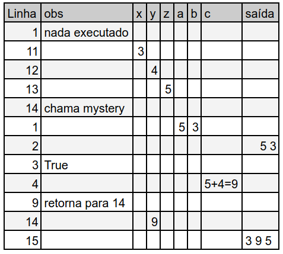

<!--
author:   Andrea Charão

email:    andrea@inf.ufsm.br

version:  0.0.1

language: PT-BR

narrator: Brazilian Portuguese Female

comment:  Material de apoio para a disciplina
          ELC106 - Algoritmo e Programação,
          da Universidade Federal de Santa Maria

translation: English  translations/English.md

link:     custom.css
          https://fonts.googleapis.com/css?family=Quattrocento%20Sans

onload
window.CodeRunner = {
    ws: undefined,
    handler: {},

    init(url) {
        this.ws = new WebSocket(url);
        const self = this
        this.ws.onopen = function () {
            self.log("connections established");
            setInterval(function() {
                self.ws.send("ping")
            }, 15000);
        }
        this.ws.onmessage = function (e) {
            // e.data contains received string.

            let data
            try {
                data = JSON.parse(e.data)
            } catch (e) {
                self.warn("received message could not be handled =>", e.data)
            }
            if (data) {
                self.handler[data.uid](data)
            }
        }
        this.ws.onclose = function () {
            self.warn("connection closed")
        }
        this.ws.onerror = function (e) {
            self.warn("an error has occurred => ", e)
        }
    },
    log(...args) {
        console.log("CodeRunner:", ...args)
    },
    warn(...args) {
        console.warn("CodeRunner:", ...args)
    },
    handle(uid, callback) {
        this.handler[uid] = callback
    },
    send(uid, message) {
        message.uid = uid
        this.ws.send(JSON.stringify(message))
    }
}

//window.CodeRunner.init("wss://coderunner.informatik.tu-freiberg.de/")
//window.CodeRunner.init("wss://testing-coderunner.andreaschwertne.repl.co/")
window.CodeRunner.init("wss://pythoncoderunner.andreaschwertne.repl.co/")

//window.CodeRunner.init("wss://ancient-hollows-41316.herokuapp.com/")
//window.CodeRunner.init("ws://127.0.0.1:8000/")

@end


@LIA.python:  @LIA.python3
@LIA.python2: @LIA.eval(`["main.py"]`, `python2.7 -m compileall .`, `python2.7 main.pyc`)
@LIA.python3: @LIA.eval(`["main.py"]`, `none`, `python3 main.py`)


@LIA.eval:  @LIA.eval_(false,`@0`,@1,@2)

@LIA.evalWithDebug: @LIA.eval_(true,`@0`,@1,@2)

@LIA.eval_
<script>
function random(len=16) {
    let chars = 'ABCDEFGHIJKLMNOPQRSTUVWXYZabcdefghijklmnopqrstuvwxyz0123456789';
    let str = '';
    for (let i = 0; i < len; i++) {
        str += chars.charAt(Math.floor(Math.random() * chars.length));
    }
    return str;
}

const uid = random()
var order = @1
var files = []

if (order[0])
  files.push([order[0], `@'input(0)`])
if (order[1])
  files.push([order[1], `@'input(1)`])
if (order[2])
  files.push([order[2], `@'input(2)`])
if (order[3])
  files.push([order[3], `@'input(3)`])
if (order[4])
  files.push([order[4], `@'input(4)`])
if (order[5])
  files.push([order[5], `@'input(5)`])
if (order[6])
  files.push([order[6], `@'input(6)`])
if (order[7])
  files.push([order[7], `@'input(7)`])
if (order[8])
  files.push([order[8], `@'input(8)`])
if (order[9])
  files.push([order[9], `@'input(9)`])


send.handle("input", (e) => {
    CodeRunner.send(uid, {stdin: e})
})
send.handle("stop",  (e) => {
    CodeRunner.send(uid, {stop: true})
});


CodeRunner.handle(uid, function (msg) {
    switch (msg.service) {
        case 'data': {
            if (msg.ok) {
                CodeRunner.send(uid, {compile: @2})
            }
            else {
                send.lia("LIA: stop")
            }
            break;
        }
        case 'compile': {
            if (msg.ok) {
                if (msg.message) {
                    if (msg.problems.length)
                        console.warn(msg.message);
                    else
                        console.log(msg.message);
                }

                send.lia("LIA: terminal")
                CodeRunner.send(uid, {exec: @3})

                if(!@0) {
                  console.clear()
                }
            } else {
                send.lia(msg.message, msg.problems, false)
                send.lia("LIA: stop")
            }
            break;
        }
        case 'stdout': {
            if (msg.ok)
                console.stream(msg.data)
            else
                console.error(msg.data);
            break;
        }

        case 'stop': {
            if (msg.error) {
                console.error(msg.error);
            }

            if (msg.images) {
                for(let i = 0; i < msg.images.length; i++) {
                    console.html("<hr/>", msg.images[i].file)
                    console.html("")
                }

            }

            send.lia("LIA: stop")
            break;
        }

        default:
            console.log(msg)
            break;
    }
})


CodeRunner.send(
    uid, { "data": files }
);

"LIA: wait"
</script>
@end
-->
<!--
liascript-devserver --input README.md --port 3001 --live
link:     https://cdn.jsdelivr.net/gh/liascript/custom-style/custom.min.css
          https://cdn.jsdelivr.net/gh/andreainfufsm/elc106-2023a/classes/06/custom.css

-->


# Aula 06

- Requisito: exercícios da aula anterior.

- Inicie visualizando a seção de Revisão.

- Hoje: repetição com `for` e mais exercícios com listas


## Revisão


Você entendeu?

- Execução passo-a-passo (com e sem computador)
- Listas (tipo de dado composto)
- Repetição com `while`


### Execução passo-a-passo

Qual será a saída deste código?

```python
def mystery(a, b):
  print(a, b)
  if a > b:
    c = a + 4
  elif b > a:
    c = b - 2
  else:
    c = -1
  return c

x = 3
y = 4
z = 5
y = mystery(z, x)
print(x, y, z)
```
@LIA.python3()


Passo-a-passo "no papel": trace table / teste de mesa



#### No papel!

Em uma tabela em papel, mostre passo-a-passo qual será a saída exibida por este código:

```python
1: def xpto (n1, n2):
2:   while n1 != n2:
3:     if (n1 < n2):
4:       n2 = n2 - n1
5:     else:
6:       n1 = n1 - n2
7:   return n1
8: print(xpto(20,5))
```

Fonte: Questão adaptada de prova de concurso elaborada pela FGV 

### Listas

- Recurso da linguagem para representar conjuntos de dados
- Coleção de valores acessíveis por um único nome de variável

  Exemplos:

  ```python
  a = 10
  numeros = [a, a+1, a+2]
  print('Conteúdo da lista é:', numeros)
  print('Tamanho da lista é:', len(numeros))

  ```
  @LIA.python3()


#### Acesso a elementos

> Podemos acessar cada elemento da lista usando índices 

> Python numera (indexa) os elementos a partir de zero

```python
verbos = ['correr','saltar','repetir']
print(verbos[0])
```
@LIA.python3()


``` ascii
 verbos = ['correr','saltar','repetir']

          +----------+----------+-----------+
 verbos = | 'correr' | 'saltar' | 'repetir' |
          +----------+----------+-----------+
               0          1           2
```

#### Funções com listas


Algumas funções com listas: https://docs.python.org/pt-br/3/tutorial/datastructures.html

Por exemplo, dada uma lista `xs`:

- `len(xs)`: retorna tamanho (quantidade de itens) da lista
- `xs.count(10)`: conta quantos elementos são iguais ao valor `10` na lista
- `xs.count(val)`: conta quantos elementos são iguais ao valor da variável `val`
- `xs.append(10)`: adiciona valor `10` ao fim da lista
- `xs.insert(i, 10)`: insere valor `10` na posição `i` da lista
- `xs.pop()`: remove último item da lista e o retorna
- `xs.pop(0)`: remove item na posição `0` da lista e o retorna
- `xs.remove(val)`: remove valor da variável `val` da lista, se existir
- `xs.clear()`: remove todos os elementos da lista


### Repetição com `while`

- É uma poderosa estrutura de controle da execução
- Executa um bloco de comandos repetidamente enquanto uma condição for verdadeira


#### Número indefinido de repetições

Podemos usar `while` em repetições que vão executar um número indefinido de vezes

```python
while True:
  senha = input('Digite a senha: ')
  if senha == "abracadabra":
    break
  else:
    print('Senha incorreta. Tente novamente')
```
@LIA.python3()


```python
from random import randint
while True:
  n = randint(1,10)
  print(n)
  if n == 6:
    break
```
@LIA.python3()


#### Número definido de repetições

Também podemos usar `while` em repetições com um número definido de vezes (ou seja, existe um máximo)

Chamar cada um dos pets :-)

```python
pets = ['Max', 'Chloe', 'Mel', 'Buddy']
i = 0
while i < len(pets):
  print('Where are you', pets[i], '?')
  i = i + 1
```
@LIA.python3()


Calcular o fatorial de um número:

```python
def fat(n):
  """ Fatorial de um número positivo, maior ou igual a zero """
  fat = 1
  while n > 0:
    fat = fat * n
    n = n - 1
  return fat  

print(fat(5)) 
print(5*4*3*2*1) 
```
@LIA.python3()


Verificar se uma lista de dígitos pode representar um número binário: 

```python
def isbin(digits):
  i = 0
  while i < len(digits):
    if digits[i] == 0 or digits[i] == 1:
      i = i + 1
    else:
      return False
  return True and len(digits) > 0

list1 = [0,1,1,0]
list2 = [0,1,2,3]
print(isbin(list1))
print(isbin(list2))
```
@LIA.python3()


## Mais repetição e listas


###  Qual será a saída?

> Aqui temos uma **novidade**: comando `for`

Com `for`:

```python
friends = ['Ana', 'Barbara', 'Clara']
for x in friends:
  print('Hello', x)
```
@LIA.python3()

Com `while`:

```python
friends = ['Ana', 'Barbara', 'Clara']
i = 0
while i < len(friends):
  print('Hello', friends[i])
  i = i + 1
```
@LIA.python3()


### Usando `for`

> Use `for` para executar um bloco de comandos para cada elemento de uma sequência.

> Não se preocupe com contador / índice: `for` cuida disso para você! 

Forma geral:

```python
for variável in coleção:
  comando1
  ...
  comandon
```

Observações:

- Também chamado de laço/loop do tipo `for`
- Bloco de comandos recuado à direita (indent) 
- Variável assume um valor a cada iteração do laço
- Execução pode ser interrompida com comando `break`
- Execução continua em sequência depois do bloco


### Passo-a-passo


Execute este programa passo-a-passo no [Python Tutor](https://pythontutor.com/visualize.html#code=friends%20%3D%20%5B'Ana',%20'Barbara',%20'Clara'%5D%0Afor%20x%20in%20friends%3A%0A%20%20print%28'Hello',%20x%29%0Aprint%28'Fim'%29%20%20&cumulative=false&curInstr=0&heapPrimitives=nevernest&mode=display&origin=opt-frontend.js&py=3&rawInputLstJSON=%5B%5D&textReferences=false):


<iframe width="800" height="500" frameborder="0" src="https://pythontutor.com/iframe-embed.html#code=friends%20%3D%20%5B'Ana',%20'Barbara',%20'Clara'%5D%0Afor%20x%20in%20friends%3A%0A%20%20print%28'Hello',%20x%29%0Aprint%28'Fim'%29%20%20&codeDivHeight=400&codeDivWidth=350&cumulative=false&curInstr=0&heapPrimitives=nevernest&origin=opt-frontend.js&py=3&rawInputLstJSON=%5B%5D&textReferences=false"> </iframe>


### Função `range` (sequências)

> E se a repetição precisar de uma sequência de números?

Com `while`:

```python
contador = 1
while contador < 10:
  print(contador)
  contador = contador + 1
print('Fim')
```
@LIA.python3()


Com `for` e lista constante (não faça isso!):

```python
for contador in [1,2,3,4,5,6,7,8,9]:
  print(contador)
print('Fim')
```
@LIA.python3()

Com `for` e `range` (bem melhor!):

```python
for contador in range(1,10):
  print(contador)
print('Fim')
```
@LIA.python3()


### Mais sobre `range`

- Retorna uma sequência de números **até um limite** (não incluído - intervalo aberto)
- Por padrão (default), sequência inicia em 0 (start=0) e é icrementada de 1 (step=1)
- Parâmetros opcionais permitem sequências variadas

Formas gerais:

```python
range(stop)
range(start, stop)
range(start, stop, step)
```

| Parâmetro   | Descrição  |
| :--------- | :--------- |
| `start`     | (Opcional) Valor inicial da sequência (default = 0)    |
| `stop`     | (Obrigatório) Valor de parada da sequência (não incluúdo)  |
| `step`     | (Opcional) Valor de incremento da sequência, pode ser negativo (default = 1)  |

### Exemplos com `range`

- O resultado de `range` pode ser convertido para lista com a função `list`
- Quando usamos `range` com `for` não precisamos converter para lista


```python
xs = list(range(5))
print(xs)
xs = list(range(10,20,2))
print(xs)
xs = list(range(10, 5, -1))
print(xs)
xs = list(range(10, 5))
print(xs)
```
@LIA.python3()


#### Com variáveis


```python
from random import randint
step = randint(1,2)
print('Step:', step)
xs = list(range(1,10,step))
print(xs)
```
@LIA.python3()

## Exemplos com laços/loops `for`


### Gerando vários números

O código abaixo gera quantos números aleatórios?

Com `for`

```python
from random import randint
for seq in range(5):
  n = randint(1,20)
  print(n)
print('Fim da geração')
```
@LIA.python3()

Com `while`

```python
from random import randint
seq = 0
while seq < 5:
  n = randint(1,20)
  print(n)
  seq = seq + 1
print('Fim da geração')
```
@LIA.python3()


### Contagem regressiva


O código abaixo mostra na tela uma contagem regressiva

Com `for`

```python
for num in range(10,0,-1):
  print(num)
print('Boom!')
```
@LIA.python3()


Com `while`

```python
num = 10
while num > 0:
  print(num)
  num = num - 1
print('Boom!')
```
@LIA.python3()


### Tabela de multiplicação

O código abaixo mostra a "tabuada" do 3

Com `for`

```python
n = 3
for mult in range(11):
  print(n, 'x', mult, '=', n*mult)
```
@LIA.python3()

Com `while`


```python
mult = 0
n = 3
while mult <= 10:
  print(n, 'x', mult, '=', n*mult)
  mult = mult + 1
```
@LIA.python3()


### Laço com bloco condicional

Sempre podemos usar  `if` dentro dos laços

Com `for`

```python
from random import randint
for contador in range(5): # contador não é usado
  n = randint(1, 6)
  print('Sorteamos o número', n)
  if n == 6:
    print('Oba, tiramos o maior número!')
```
@LIA.python3()

Com `while`

```python
from random import randint
contador = 0
while contador < 5:
  n = randint(1, 6)
  print('Sorteamos o número', n)
  if n == 6:
    print('Oba, tiramos o maior número!')
  contador = contador + 1
```
@LIA.python3()


### Laço não executado

Se usarmos `for` com uma coleção vazia, o bloco de comandos não é executado.


```python
for i in range(1,10,-1):
  print('Não vou ser executado')
print('Fim do programa')  
```
@LIA.python3()


### Somatório de valores


Com `for`: só precisamos da variável acumuladora da soma

```python
from random import randint, seed
seed(1)
soma = 0
for i in range(10):
  n = randint(1, 6)
  print('n =', n)
  soma = soma + n
print('Somatório:', soma)
```
@LIA.python3()

Com `while`: precisamos de uma variável contadora para o laço e uma acumuladora para a soma


```python
from random import randint, seed
seed(1)
i = 1
soma = 0
while i <= 10:
  n = randint(1, 6)
  print('n =', n)
  soma = soma + n
  i = i + 1
print('Somatório:', soma)
```
@LIA.python3()


### Triângulo

Concatenando strings com `+`

 <details>
  <summary>Clique aqui para ver outra forma de fazer isso</summary>
  <p>Ao contrário da maioria das linguagens, Python permite replicar strings com o operador '\*'. Por exemplo: 3*'z' resulta em 'zzz'. </p>
</details> 


```python
def replica(c, n):
  s = ''
  for i in range(n):
    s += c
  return s

for i in range(1,11):  
  print(replica('*',i))
  
```
@LIA.python3()


Execute este programa passo-a-passo no [Python Tutor](https://pythontutor.com/visualize.html#code=def%20replica%28c,%20n%29%3A%0A%20%20s%20%3D%20''%0A%20%20for%20i%20in%20range%28n%29%3A%0A%20%20%20%20s%20%2B%3D%20c%0A%20%20return%20s%0A%0Afor%20i%20in%20range%281,5%29%3A%20%20%0A%20%20print%28replica%28'*',i%29%29&cumulative=false&curInstr=50&heapPrimitives=nevernest&mode=display&origin=opt-frontend.js&py=3&rawInputLstJSON=%5B%5D&textReferences=false):


<iframe width="800" height="500" frameborder="0" src="https://pythontutor.com/iframe-embed.html#code=def%20replica%28c,%20n%29%3A%0A%20%20s%20%3D%20''%0A%20%20for%20i%20in%20range%28n%29%3A%0A%20%20%20%20s%20%2B%3D%20c%0A%20%20return%20s%0A%0Afor%20i%20in%20range%281,5%29%3A%20%20%0A%20%20print%28replica%28'*',i%29%29&codeDivHeight=400&codeDivWidth=350&cumulative=false&curInstr=50&heapPrimitives=nevernest&origin=opt-frontend.js&py=3&rawInputLstJSON=%5B%5D&textReferences=false"> </iframe>


## Exercícios no Repl.it

- Entre no grupo da disciplina no Repl.it: https://replit.com/teams/join/bzmdfmvrldnyymssuydqhwpkmoidivlo-elc106-2023a

- Em `Projects`, selecione a `aula06` 

- Veja as `Instructions` e preencha os exercícios nos arquivos indicados

- Use `Run` com frequência para testar seu código

- Clique em `Submit` para enviar os exercícios para a professora

- Mais adiante, use a aba `Threads` para visualizar comentários da professora sobre seu código


<a href="https://forms.gle/5GPjzMis5uKUEaxE6">https://forms.gle/5GPjzMis5uKUEaxE6</a>

