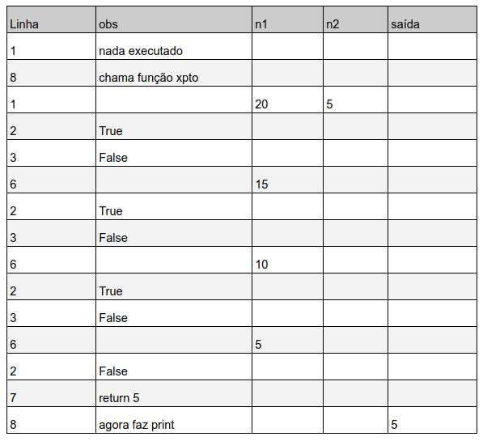

<!--
author:   Andrea Charão

email:    andrea@inf.ufsm.br

version:  0.0.1

language: PT-BR

narrator: Brazilian Portuguese Female

comment:  Material de apoio para a disciplina
          ELC106 - Algoritmo e Programação,
          da Universidade Federal de Santa Maria

translation: English  translations/English.md

link:     custom.css
          https://fonts.googleapis.com/css?family=Quattrocento%20Sans

onload
window.CodeRunner = {
    ws: undefined,
    handler: {},

    init(url) {
        this.ws = new WebSocket(url);
        const self = this
        this.ws.onopen = function () {
            self.log("connections established");
            setInterval(function() {
                self.ws.send("ping")
            }, 15000);
        }
        this.ws.onmessage = function (e) {
            // e.data contains received string.

            let data
            try {
                data = JSON.parse(e.data)
            } catch (e) {
                self.warn("received message could not be handled =>", e.data)
            }
            if (data) {
                self.handler[data.uid](data)
            }
        }
        this.ws.onclose = function () {
            self.warn("connection closed")
        }
        this.ws.onerror = function (e) {
            self.warn("an error has occurred => ", e)
        }
    },
    log(...args) {
        console.log("CodeRunner:", ...args)
    },
    warn(...args) {
        console.warn("CodeRunner:", ...args)
    },
    handle(uid, callback) {
        this.handler[uid] = callback
    },
    send(uid, message) {
        message.uid = uid
        this.ws.send(JSON.stringify(message))
    }
}

//window.CodeRunner.init("wss://coderunner.informatik.tu-freiberg.de/")
//window.CodeRunner.init("wss://testing-coderunner.andreaschwertne.repl.co/")
window.CodeRunner.init("wss://pythoncoderunner.andreaschwertne.repl.co/")

//window.CodeRunner.init("wss://ancient-hollows-41316.herokuapp.com/")
//window.CodeRunner.init("ws://127.0.0.1:8000/")

@end


@LIA.python:  @LIA.python3
@LIA.python2: @LIA.eval(`["main.py"]`, `python2.7 -m compileall .`, `python2.7 main.pyc`)
@LIA.python3: @LIA.eval(`["main.py"]`, `none`, `python3 main.py`)


@LIA.eval:  @LIA.eval_(false,`@0`,@1,@2)

@LIA.evalWithDebug: @LIA.eval_(true,`@0`,@1,@2)

@LIA.eval_
<script>
function random(len=16) {
    let chars = 'ABCDEFGHIJKLMNOPQRSTUVWXYZabcdefghijklmnopqrstuvwxyz0123456789';
    let str = '';
    for (let i = 0; i < len; i++) {
        str += chars.charAt(Math.floor(Math.random() * chars.length));
    }
    return str;
}

const uid = random()
var order = @1
var files = []

if (order[0])
  files.push([order[0], `@'input(0)`])
if (order[1])
  files.push([order[1], `@'input(1)`])
if (order[2])
  files.push([order[2], `@'input(2)`])
if (order[3])
  files.push([order[3], `@'input(3)`])
if (order[4])
  files.push([order[4], `@'input(4)`])
if (order[5])
  files.push([order[5], `@'input(5)`])
if (order[6])
  files.push([order[6], `@'input(6)`])
if (order[7])
  files.push([order[7], `@'input(7)`])
if (order[8])
  files.push([order[8], `@'input(8)`])
if (order[9])
  files.push([order[9], `@'input(9)`])


send.handle("input", (e) => {
    CodeRunner.send(uid, {stdin: e})
})
send.handle("stop",  (e) => {
    CodeRunner.send(uid, {stop: true})
});


CodeRunner.handle(uid, function (msg) {
    switch (msg.service) {
        case 'data': {
            if (msg.ok) {
                CodeRunner.send(uid, {compile: @2})
            }
            else {
                send.lia("LIA: stop")
            }
            break;
        }
        case 'compile': {
            if (msg.ok) {
                if (msg.message) {
                    if (msg.problems.length)
                        console.warn(msg.message);
                    else
                        console.log(msg.message);
                }

                send.lia("LIA: terminal")
                CodeRunner.send(uid, {exec: @3})

                if(!@0) {
                  console.clear()
                }
            } else {
                send.lia(msg.message, msg.problems, false)
                send.lia("LIA: stop")
            }
            break;
        }
        case 'stdout': {
            if (msg.ok)
                console.stream(msg.data)
            else
                console.error(msg.data);
            break;
        }

        case 'stop': {
            if (msg.error) {
                console.error(msg.error);
            }

            if (msg.images) {
                for(let i = 0; i < msg.images.length; i++) {
                    console.html("<hr/>", msg.images[i].file)
                    console.html("")
                }

            }

            send.lia("LIA: stop")
            break;
        }

        default:
            console.log(msg)
            break;
    }
})


CodeRunner.send(
    uid, { "data": files }
);

"LIA: wait"
</script>
@end
-->
<!--
liascript-devserver --input README.md --port 3001 --live
link:     https://cdn.jsdelivr.net/gh/liascript/custom-style/custom.min.css
          https://cdn.jsdelivr.net/gh/andreainfufsm/elc106-2023a/classes/06/custom.css

-->


# Aula 07: Revisão


- Correção da questão de concurso

- Orientações sobre avaliações

- Mais questões, exemplos e exercícios


## Correção da questão de concurso


Qual será a saída deste código?


```python
1: def xpto (n1, n2):
2:   while n1 != n2:
3:     if (n1 < n2):
4:       n2 = n2 - n1
5:     else:
6:       n1 = n1 - n2
7:   return n1
8: print(xpto(20,5))
```

Fonte: Questão adaptada de prova de concurso elaborada pela FGV 


### Resposta (curta) em tabela




### Resposta (longa) em detalhes


Para entender este código, você precisa lembrar que o computador vai executar as instruções passo-a-passo.

```python
1: def xpto (n1, n2):
2:   while n1 != n2:
3:     if (n1 < n2):
4:       n2 = n2 - n1
5:     else:
6:       n1 = n1 - n2
7:   return n1
8: print(xpto(20,5))
```

Vamos detalhar isso e aproveitar para revisar conteúdos importantes vistos nas aulas.

> Clique na seta -> abaixo para avançar


                 {{1}}
************************************************

**Execução de sequências**

Em muitos programas, alguns passos ocorrem em sequência, uma linha imediatamente após a outra. Sequências de instruções são a forma mais simples de construir um programa.

Por exemplo, no código abaixo, temos apenas instruções em sequência:

```python
num = 0
print('O número é', num)
num = num + 1
print('Agora o número é', num)
```
@LIA.python3()

************************************************


                 {{2}}
************************************************

**Execução de funções, condicionais e repetições**

Algumas instruções que vimos nas aulas alteram a ordem de execução, provocando "desvios" ou "saltos" de uma linha para outra. Isso acontece, por exemplo, com funções, com condicionais (`if`/`elif`/`else`) e com repetições (`while`/`for`),

Para entender essas instruções mais "poderosas" (e nada óbvias), você também precisa entender que o Python agrupa linhas em **blocos**. Linhas que formam um mesmo bloco precisam estar alinhadas - devem iniciar na mesma coluna. Além disso, blocos afetados por algumas instruções (`def`, `if/elif/else`, `while`, `for`, etc.) devem estar recuados em relação à instrução. Chamamos esse recuo de "endentação", "indentação" ou "indent".


************************************************

                 {{3}}
************************************************

**Blocos endentados em funções**

Quando temos uma definição de função, as linhas que compõem os comandos dessa função fazem parte de um bloco. Esse bloco precisa estar recuado em relação à primeira linha da função. 

No exemplo abaixo, as linhas 2, 3 e 4 estão recuadas e formam o bloco de instruções da função `func`. As linhas 5 e 6 não fazem parte do bloco - essas linhas compõem o bloco principal do programa, que é executado em sequência.

```python
def func(x):
  x = x + 1
  x = x * 2
  return x
resultado = func(4)
print(resultado)  
```
@LIA.python3()


************************************************


                 {{4}}
************************************************

**Blocos endentados em condicionais**


Aqui temos um código que sorteia um número entre 2 opções: 0 ou 1, usando a função `randint`. Se (`if`) o número for igual (`==`) a 0, o programa mostra na tela o texto `Cara`. Caso contrário (senão, `else`), mostra o texto `Coroa`. As linhas 4 e 6 estão endentadas/recuadas porque são as instruções que serão executadas em cada situação, ou seja, se a condição for verdadeira (n igual a 0) ou se a condição for falsa (n diferente de 0). Caso tivéssemos mais instruções a executar em cada caso, as linhas de código deveriam estar recuadas também, exatamente como as linhas 4 e 6.

Note que as linhas 3, 4, 5 e 6 nunca serão executadas juntas em sequência. Conforme a condição for verdadeira ou falsa, um dos blocos (linha 4 ou linha 6) será executado e outro não.

```python
from random import randint
n = randint(0,1)
if n == 0:
  print('Cara')
else:
  print('Coroa')
```
@LIA.python3()

************************************************

                 {{5}}
************************************************

**Blocos endentados em repetições**

Neste outro código, temos uma repetição com `for`. Para cada item de uma lista de sabores de sorvete, o programa mostrará uma mensagem na tela. A linha 2 está endentada/recuada porque é a instrução que será repetida. A linha 3 não faz parte do bloco `for` e, portanto, não será repetida - será executada somente depois que a execução do loop (laço) terminar.


```python
for sabor in ['morango', 'chocolate', 'flocos']:
  print('Gosto de sorvete de', sabor)
print('Fim')  
```
@LIA.python3()


************************************************


                 {{6}}
************************************************

**Voltando ao código inicial**

Depois da breve revisão, vamos nos concentrar de novo no código que estávamos analisando.

Veja que este código possui várias linhas recuadas, compondo diferentes blocos.

```python
1: def xpto (n1, n2):
2:   while n1 != n2:
3:     if (n1 < n2):
4:       n2 = n2 - n1
5:     else:
6:       n1 = n1 - n2
7:   return n1
8: print(xpto(20,5))
```

************************************************

                 {{7}}
************************************************

**Linha 1 - definição de função**

Quando o computador encontra uma linha de definição de função, ele apenas guarda essa definição na memória, para uso futuro. A função só será executada quando for chamada em outra linha de código, com valores para seus argumentos. Ou seja, uma definição de função não tem efeito imediato na execução do programa.

Então, quando a execução passo-a-passo chegar em uma linha de definição de função, a execução continua após o bloco de comandos da função.

No código abaixo, a definição da função vai da linha 1 até a linha 7. Então, a execução do programa salta da linha 1 para a linha 8, que é a próxima (e única) linha após a definição da função. Como sabemos isso? Porque a linha 8 não está recuada como as linhas 2 a 7. 

```python
1: def xpto (n1, n2):
2:   while n1 != n2:
3:     if (n1 < n2):
4:       n2 = n2 - n1
5:     else:
6:       n1 = n1 - n2
7:   return n1
8: print(xpto(20,5))
```
************************************************

                 {{8}}
************************************************

**Linha 8 - chamada de função**


Na linha 8, temos o comando `print`, que é um comando de saída - serve para instruir o computador a mostrar algo na tela. 
Este `print` é bem simples: o único dado a ser impresso vai ser o resultado da função `xpto`  aplicada aos valores `20` e `5`.
O `print` só poderá ser feito quando tivermos o resultado de `xpto`, por isso a execução vai saltar da linha 8 para a linha 1, desta vez para realmente executar a função `xpto`.

Quando chamamos (ou aplicamos) uma função, colocamos entre parênteses valores para seus parâmetros. Chamamos isso de passagem de argumentos/parâmetros. Esses valores serão usados na execução da função, na ordem em que foram passados, da mesma forma que usamos variáveis.
No exemplo, o parâmetro `n1` receberá o valor `20` e o parâmetro `n2` receberá o valor `5`. 

************************************************

                 {{9}}
************************************************

**Linha 2 - repetição**


Agora que temos valores de `n1`  e `n2`, podemos prosseguir na execução passo-a-passo. A próxima linha a ser executada será a 2, que inicia um bloco de repetição `while`.  Este comando do Python serve para repetir a execução de um bloco de comandos enquanto uma dada condição for verdadeira. Neste exemplo, a condição é `n1 != n2`, que significa "n1 diferente de n2". Como neste ponto realmente `n1` é diferente de `n2` (pois 20 é diferente de 5), a execução prossegue na linha 3.

```python
1: def xpto (n1, n2):
2:   while n1 != n2:    # <== estamos aqui
3:     if (n1 < n2):
4:       n2 = n2 - n1
5:     else:
6:       n1 = n1 - n2
7:   return n1
8: print(xpto(20,5))
```

************************************************


                 {{10}}
************************************************

**Linha 3 - condicional**

Na linha 3, temos uma instrução `if` com a condição `n1 < n2`. Neste ponto da execução, a condição será `False`, pois n1 (20) não é menor que n2 (5). A execução não entra no bloco representado pela linha 4 - essa linha só seria executada se n1 fosse menor que n2. Ocorre um salto da execução para o `else` (senão), que instrui o que deve ser feito caso a condição da linha 3 não seja verdadeira. 

```python
1: def xpto (n1, n2):
2:   while n1 != n2:    
3:     if (n1 < n2):      # <== aqui testamos a condição
4:       n2 = n2 - n1
5:     else:
6:       n1 = n1 - n2     # <== esta linha será executada
7:   return n1
8: print(xpto(20,5))
```

Na linha 6, que é o bloco do `else`, ocorre uma atualização da variável `n1`: seu valor era 20 e agora passa a ser 20-5, que é igual a 15.
Após a linha 6, a execução **não** segue para a linha 7! A linha 6 faz parte do bloco do `while`, que representa um laço, e por isso a execução salta para o início do `while`, linha 2. 

************************************************

                 {{11}}
************************************************

**Linha 2 - repetição continua**


```python
1: def xpto (n1, n2):
2:   while n1 != n2:    # <== voltamos para cá
3:     if (n1 < n2):
4:       n2 = n2 - n1
5:     else:
6:       n1 = n1 - n2
7:   return n1
8: print(xpto(20,5))
```

Neste ponto da execução, o `while` vai verificar novamente a condição. Desta vez, temos `n1=15` e `n2=5`. Os valores mudaram, mas a condição `n1 != n2` continua
verdadeira, pois 15 é diferente de 5.  

A execução vai novamente para a linha 3, onde temos a instrução `if` com a condição `n1 < n2`, que será novamente `False`, pois 15 não é menor que 5. Ocorre novamente um salto da execução para o `else`, que faz executar a linha 6.

Na linha 6, temos novamente a atualização de `n1`: seu valor era 15 e agora passa a ser 15-5, que é igual a 10.
Após a linha 6, a execução salta para o início do laço, linha 2.

************************************************

                 {{12}}
************************************************

**Linha 2 - repetindo mais uma vez**


```python
1: def xpto (n1, n2):
2:   while n1 != n2:    # <== repetindo mais uma vez
3:     if (n1 < n2):
4:       n2 = n2 - n1
5:     else:
6:       n1 = n1 - n2
7:   return n1
8: print(xpto(20,5))
```

Mais uma vez, o `while` vai verificar a condição. Desta vez, temos `n1=10` e `n2=5`. Os valores mudaram de novo, mas a condição `n1 != n2` continua
verdadeira, pois 10 é diferente de 5.  A execução vai novamente para a linha 3, onde temos a instrução `if` com a condição `n1 < n2`, que será mais uma vez `False`, pois 10 não é menor que 5. Ocorre novamente um salto da execução para o `else`, que faz executar a linha 6.

Na linha 6, temos outra vez a atualização de `n1`: seu valor era 10 e agora passa a ser 10-5, que é igual a 5.
Após a linha 6, a execução salta para o início do laço, linha 2.


************************************************


                 {{13}}
************************************************

**Linha 2 - repetição chega ao fim**

```python
1: def xpto (n1, n2):
2:   while n1 != n2:    # <== finalmente vai ser False
3:     if (n1 < n2):
4:       n2 = n2 - n1
5:     else:
6:       n1 = n1 - n2
7:   return n1          # <== agora podemos retornar
8: print(xpto(20,5))
```

Na linha 2, o `while` vai verificar novamente a condição. Agora temos `n1=5` e `n2=5`. A condição `n1 != n2` (n1 diferente de n2) finalmente será `False`, então termina a repetição do bloco. Qual a próxima linha depois do bloco? É a linha 7, que indica que a função deve **retornar** (`return`) o resultado (n1=5) para o ponto do código em que foi chamada, ou seja, a linha 8.

************************************************

                 {{14}}
************************************************

**Linha 8 - resultado final**

Na linha 8, agora temos o resultado da função `xpto`, que é 5. Portanto, finalmente o `print` poderá mostrar esse resultado na tela.

************************************************


### Passo-a-passo no Python Tutor


Execute este programa passo-a-passo no [Python Tutor](https://pythontutor.com/visualize.html#code=def%20xpto%20%28n1,%20n2%29%3A%0A%20%20while%20n1%20!%3D%20n2%3A%0A%20%20%20%20if%20%28n1%20%3C%20n2%29%3A%0A%20%20%20%20%20%20n2%20%3D%20n2%20-%20n1%0A%20%20%20%20else%3A%0A%20%20%20%20%20%20n1%20%3D%20n1%20-%20n2%0A%20%20return%20n1%0Aprint%28xpto%2820,5%29%29&cumulative=false&curInstr=15&heapPrimitives=nevernest&mode=display&origin=opt-frontend.js&py=3&rawInputLstJSON=%5B%5D&textReferences=false):


<iframe width="800" height="500" frameborder="0" src="https://pythontutor.com/iframe-embed.html#code=def%20xpto%20%28n1,%20n2%29%3A%0A%20%20while%20n1%20!%3D%20n2%3A%0A%20%20%20%20if%20%28n1%20%3C%20n2%29%3A%0A%20%20%20%20%20%20n2%20%3D%20n2%20-%20n1%0A%20%20%20%20else%3A%0A%20%20%20%20%20%20n1%20%3D%20n1%20-%20n2%0A%20%20return%20n1%0Aprint%28xpto%2820,5%29%29&codeDivHeight=400&codeDivWidth=350&cumulative=false&curInstr=15&heapPrimitives=nevernest&origin=opt-frontend.js&py=3&rawInputLstJSON=%5B%5D&textReferences=false"> </iframe>


## Vídeo

> Ative legenda automática em português!

Veja este vídeo que resume os conceitos de sequências, condicionais/seleções e laços/loops/iterações usando exemplos do dia-a-dia (não é Python!)


<iframe width="560" height="315" src="https://www.youtube.com/embed/eSYeHlwDCNA" title="YouTube video player" frameborder="0" allow="accelerometer; autoplay; clipboard-write; encrypted-media; gyroscope; picture-in-picture; web-share" allowfullscreen></iframe>


## Questões

Quando solicitado em aula, siga estas instruções:

- Clique no botão de compartilhamento no canto superior direito 
- Clique em `Classroom`
- Selecione o `backend` informado pela professora
- Preencha o `room` informado pela professora


                 {{1}}
************************************************

O que será mostrado na saída deste programa?

```python
x = 5
x = x + 2
print(x)
```

[('5')] 5
[('2')] 2
[('7')] 7

************************************************


                 {{2}}
************************************************

Quais linhas fazem parte do bloco de instruções da função `func`?

```python
1: def func(x):
2:   x = x + 1
3:   x = x + 2
4:   return x
5: z = func(10)
6: print(z)
```


[('2 a 3')] 2 a 3
[('2 a 4')] 2 a 4
[('1 a 6')] 1 a 6

************************************************


                 {{3}}
************************************************

Qual será a saída do programa abaixo?

```python
def func(x):
  x = x + 1
  x = x + 2
  return x
z = func(10)
print(z)
```

[('10')] 10
[('12')] 12
[('13')] 13

************************************************


                 {{4}}
************************************************

Qual será a saída do programa abaixo?

```python
def func(a, b):
  a += 2
  b += 3
  if b > a:
    return b
  else:
    return a  
z = func(10, 11)
print(z)
```

[('13')] 13
[('14')] 14
[('15')] 15

************************************************


                 {{5}}
************************************************

O que será mostrado na saída deste programa?

```python
words = ['I', 'love', 'Python']
for w in words:
  if len(w) > 6:
    print(w)   
```


[(python)] Python
[(nada)] nada
[(naosei)] não sei

************************************************


                 {{6}}
************************************************

O que será mostrado ao final deste programa?

```python
pets = ['bird', 'cat', 'dog', 'pumpkin']
s = ''
for i in range(len(pets)):
  s += pets[i][0]
print(s) 
```


[(bird)] bird
[(vazio)] vazio
[(naosei)] bcdp

************************************************

                 {{7}}
************************************************

Sabendo que a função `sum` calcula o somatório de elementos de uma lista/sequência, qual será o resultado de:

```python
sum(range(10,20,5))
```

[[___]]


************************************************


                 {{8}}
************************************************

> Errou alguma questão????


Tudo bem, errar faz parte! 

Abra o Repl.it e copie o código que gerou dúvida. 

Execute, modifique, pratique!


************************************************