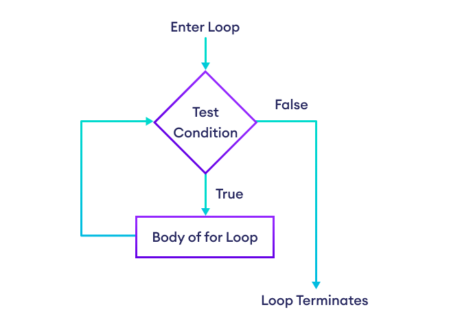

<!--
author:   Andrea Charão

email:    andrea@inf.ufsm.br

version:  0.0.1

language: PT-BR

narrator: Brazilian Portuguese Female

comment:  Material de apoio para a disciplina
          ELC106 - Algoritmo e Programação,
          da Universidade Federal de Santa Maria

translation: English  translations/English.md

link:     custom.css
          https://fonts.googleapis.com/css?family=Quattrocento%20Sans

onload
window.CodeRunner = {
    ws: undefined,
    handler: {},

    init(url) {
        this.ws = new WebSocket(url);
        const self = this
        this.ws.onopen = function () {
            self.log("connections established");
            setInterval(function() {
                self.ws.send("ping")
            }, 15000);
        }
        this.ws.onmessage = function (e) {
            // e.data contains received string.

            let data
            try {
                data = JSON.parse(e.data)
            } catch (e) {
                self.warn("received message could not be handled =>", e.data)
            }
            if (data) {
                self.handler[data.uid](data)
            }
        }
        this.ws.onclose = function () {
            self.warn("connection closed")
        }
        this.ws.onerror = function (e) {
            self.warn("an error has occurred => ", e)
        }
    },
    log(...args) {
        console.log("CodeRunner:", ...args)
    },
    warn(...args) {
        console.warn("CodeRunner:", ...args)
    },
    handle(uid, callback) {
        this.handler[uid] = callback
    },
    send(uid, message) {
        message.uid = uid
        this.ws.send(JSON.stringify(message))
    }
}

//window.CodeRunner.init("wss://coderunner.informatik.tu-freiberg.de/")
//window.CodeRunner.init("wss://testing-coderunner.andreaschwertne.repl.co/")
window.CodeRunner.init("wss://pythoncoderunner.andreaschwertne.repl.co/")

//window.CodeRunner.init("wss://ancient-hollows-41316.herokuapp.com/")
//window.CodeRunner.init("ws://127.0.0.1:8000/")

@end


@LIA.python:  @LIA.python3
@LIA.python2: @LIA.eval(`["main.py"]`, `python2.7 -m compileall .`, `python2.7 main.pyc`)
@LIA.python3: @LIA.eval(`["main.py"]`, `none`, `python3 main.py`)


@LIA.eval:  @LIA.eval_(false,`@0`,@1,@2)

@LIA.evalWithDebug: @LIA.eval_(true,`@0`,@1,@2)

@LIA.eval_
<script>
function random(len=16) {
    let chars = 'ABCDEFGHIJKLMNOPQRSTUVWXYZabcdefghijklmnopqrstuvwxyz0123456789';
    let str = '';
    for (let i = 0; i < len; i++) {
        str += chars.charAt(Math.floor(Math.random() * chars.length));
    }
    return str;
}

const uid = random()
var order = @1
var files = []

if (order[0])
  files.push([order[0], `@'input(0)`])
if (order[1])
  files.push([order[1], `@'input(1)`])
if (order[2])
  files.push([order[2], `@'input(2)`])
if (order[3])
  files.push([order[3], `@'input(3)`])
if (order[4])
  files.push([order[4], `@'input(4)`])
if (order[5])
  files.push([order[5], `@'input(5)`])
if (order[6])
  files.push([order[6], `@'input(6)`])
if (order[7])
  files.push([order[7], `@'input(7)`])
if (order[8])
  files.push([order[8], `@'input(8)`])
if (order[9])
  files.push([order[9], `@'input(9)`])


send.handle("input", (e) => {
    CodeRunner.send(uid, {stdin: e})
})
send.handle("stop",  (e) => {
    CodeRunner.send(uid, {stop: true})
});


CodeRunner.handle(uid, function (msg) {
    switch (msg.service) {
        case 'data': {
            if (msg.ok) {
                CodeRunner.send(uid, {compile: @2})
            }
            else {
                send.lia("LIA: stop")
            }
            break;
        }
        case 'compile': {
            if (msg.ok) {
                if (msg.message) {
                    if (msg.problems.length)
                        console.warn(msg.message);
                    else
                        console.log(msg.message);
                }

                send.lia("LIA: terminal")
                CodeRunner.send(uid, {exec: @3})

                if(!@0) {
                  console.clear()
                }
            } else {
                send.lia(msg.message, msg.problems, false)
                send.lia("LIA: stop")
            }
            break;
        }
        case 'stdout': {
            if (msg.ok)
                console.stream(msg.data)
            else
                console.error(msg.data);
            break;
        }

        case 'stop': {
            if (msg.error) {
                console.error(msg.error);
            }

            if (msg.images) {
                for(let i = 0; i < msg.images.length; i++) {
                    console.html("<hr/>", msg.images[i].file)
                    console.html("")
                }

            }

            send.lia("LIA: stop")
            break;
        }

        default:
            console.log(msg)
            break;
    }
})


CodeRunner.send(
    uid, { "data": files }
);

"LIA: wait"
</script>
@end
-->
<!--
nvm use v10.23.0
liascript-devserver --input README.md --port 3001 --live
link:     https://cdn.jsdelivr.net/gh/liascript/custom-style/custom.min.css
          https://cdn.jsdelivr.net/gh/andreainfufsm/elc106-2023a/classes/10/custom.css

-->

[](https://liascript.github.io/course/?https://raw.githubusercontent.com/AndreaInfUFSM/elc106-2023a/master/classes/10/README.md)

# Aula 10


- Inicie visualizando a seção de Revisão.

- Hoje: 

  - mais programas com estruturas de repetição: laços aninhados, recursão  
  - manipulando dados em arquivos
  

## Revisão


Você entendeu?

- Uso de `for` e listas
- Formatação de strings (trabalho extraclasse)


### Usando `for`, lista, strings

O que faz este programa? Qual será sua saída?

 <details>
  <summary>O que são estas f-strings?</summary>
  <p>Veja esta referência do trabalho extraclasse: https://www.hashtagtreinamentos.com/f-strings-em-python 
  ou esta outra aqui: https://towardsdatascience.com/five-wonderful-uses-of-f-strings-in-python-7980cfd31c0d
  </p>
</details> 

```python  
n = int(input('Digite n: '))
lista = []
for i in range(n):
  lista.append(int(input(f'Digite valor {i+1}: ')))
print(f'S {lista} = {sum(lista)}')
# print('S', lista, '=', sum(lista))
```
@LIA.python3()  


Qual a diferença? Por que agora o programa **não vai funcionar**?

```python  
n = int(input('Digite n: '))
lista = []
for i in range(n):
  lista.append(input(f'Digite valor {i+1}: '))
print(f'S {lista} = {sum(lista)}')
# print('S', lista, '=', sum(lista))
```
@LIA.python3()  


### Elefantes incomodam

Como fazer um programa para gerar a letra desta música para um número `n` de elefantes?


```
1 elefante incomoda muita gente
2 elefantes incomodam, incomodam muito mais!
3 elefantes incomodam muita gente
4 elefantes incomodam, incomodam incomodam, incomodam muito mais!
5 elefantes incomodam muita gente
6 elefantes incomodam, incomodam, incomodam, incomodam, incomodam, incomodam muito mais!
7 elefantes incomodam muita gente
8 elefantes incomodam, incomodam, incomodam, incomodam, incomodam, incomodam, incomodam, incomodam muito mais!
9 elefantes incomodam muita gente
10 elefantes incomodam, incomodam, incomodam, incomodam, incomodam, incomodam, incomodam, incomodam, incomodam, incomodam muito mais!
```

Marque os recursos de programação que podem ajudar neste problema:

- [[x]] repetição com `for`
- [[ ]] função `math.sqrt`
- [[x]] condicional com `if`/`else`
- [[x]] função `print`
- [[ ]] função `random.randint`
- [[x]] concatenação de strings
- [[x]] cálculo de resto de divisão
- [[x]] função `range`
- [[ ]] `append` em lista


## Mais repetição

Agora que você já entende `while` e `for`...





### Laços aninhados

> Em inglês: nested loops

Bloco de comandos de um laço pode conter outro(s) laço(s)!


Qual será a saída?

```python  
for w in ['happ', 'bus']:
  for s in ['y', 'ier','iest']:
    word = w+s
    print(word)
    #print(f'{w}{s}')
```
@LIA.python3()  

E agora?

```python  
for i in range(3):
  for j in [4,5,6]:
    print(i, j, i+j)
    #print(f'{i}+{j} = {i+j}')
```
@LIA.python3()  


### Recursão

> Para entender recursão, você deve entender recursão!


#### Função recursiva

- Função que chama ela mesma em sua definição
- Repetição sem usar `for`/`while` !!!
- Cada chamada à função usa um novo argumento
- É preciso uma **condição de parada** da recursão (`if/else`)
- **Curiosidade**: existem linguagens que não têm `for`/`while`, só recursão

#### Exemplo

Calcular o fatorial de um número **sem recursão**:

```python
def fat(n):
  """ Fatorial de um número maior ou igual a zero """
  fat = 1
  while n > 0:
    fat = fat * n
    n = n - 1
  return fat  

print(fat(5)) 
print(5*4*3*2*1) # equivalente
```
@LIA.python3()


Calcular o fatorial de um número **com recursão**:


```python
def fat(n):
  """ Fatorial de um número maior ou igual a zero """
  if n == 1 or n == 0:  
    return n  
  else:  
    return n * fat(n-1)  

print(fat(5)) 
print(5*4*3*2*1) # equivalente
```
@LIA.python3()


Passo-a-passo no Python Tutor:

<iframe width="800" height="500" frameborder="0" src="https://pythontutor.com/iframe-embed.html#code=def%20fat%28n%29%3A%0A%20%20%22%22%22%20Fatorial%20de%20um%20n%C3%BAmero%20maior%20ou%20igual%20a%20zero%20%22%22%22%0A%20%20if%20n%20%3D%3D%201%20or%20n%20%3D%3D%200%3A%20%20%0A%20%20%20%20return%20n%20%20%0A%20%20else%3A%20%20%0A%20%20%20%20return%20n%20*%20fat%28n-1%29%20%20%0A%0Aprint%28fat%285%29%29&codeDivHeight=400&codeDivWidth=350&cumulative=false&curInstr=22&heapPrimitives=nevernest&origin=opt-frontend.js&py=3&rawInputLstJSON=%5B%5D&textReferences=false"> </iframe>


## Manipulando dados em arquivos


- Trabalhar com dados em arquivos é abordagem "profissional": generalização, separação dados-código
- Linguagens de programação costumam ter **funções** para manipular arquivos
- Para escolher as funções apropriadas, é importante saber o **tipo/formato** do conteúdo do arquivo
- Conteúdo: textual (strings) ou binário
- Tipo/formato específico de um arquivo geralmente é expresso pela **extensão**
- Exemplos: imagens (.png, .gif, .jpeg, .jpg, .bmp, etc.), vídeos (.mp4, .mkv, etc.), dados textuais (.txt), dados tabulares (.csv, .xlsx, .ods, etc.), entre muitos outros
- Ver mais em https://www.file-extensions.org/

### Arquivos textuais

- Conteúdo textual pode ser examinado e manipulado facilmente
- Visualização do arquivo com bloco de notas, editores de texto, etc.
- Programação manipula strings
- Muitos formatos/extensões são textuais: .txt (texto em formato livre), .csv (texto em formato tabular), .html (texto com marcações para web), .svg (imagens vetoriais), .py (programas Python), etc.
- Operações básicas: abrir arquivo, escrever no arquivo, ler do arquivo, fechar arquivo


#### Exemplos de programas

Operações de escrita e leitura em arquivo:

```python
f = open("colors.txt", "w") 
f.write("red")
f.write("green")
f.close()

f = open("colors.txt", "r")
print(f.readline())
f.close()
```
@LIA.python3()

> **Quebras de linha** devem ser escritas explicitamente com `\n`:

```python
f = open("colors.txt", "w") 
f.write("red\n")
f.write("green\n")
f.close()

f = open("colors.txt", "r")
print(f.readline()) # print já quebra linha
print(f.readline()) # print já quebra linha
f.close()
```
@LIA.python3()

Livre-se das quebras de linha com funções `strip()`/`rstrip()`.

```python
f = open("colors.txt", "w") 
f.write("red\n")
f.write("green\n")
f.close()

f = open("colors.txt", "r")
print(f.readline().rstrip())
print(f.readline().rstrip())
f.close()
```
@LIA.python3()

Percorrendo um longo arquivo

```python
f = open("colors.txt", "w") 
f.write("red\n")
f.write("green\n")
f.write("blue\n")
f.close()

f = open("colors.txt", "r")
for line in f:
  print(line.rstrip())
f.close()
```
@LIA.python3()

#### Resumo de funções

Documentação sobre manipulação básica de arquivos: 

- https://docs.python.org/3/tutorial/inputoutput.html#reading-and-writing-files
- https://easypythondocs.com/fileaccess.html
- https://python-reference.readthedocs.io/en/latest/docs/file/

Principais funções:

- `open`: abre um arquivo (veja modos: "r", "w", etc.)
- com um arquivo `f`

  - `f.close`: fecha o arquivo
  - `f.write`: escreve no arquivo
  - `f.read`: lê todo o arquivo e o armazena em string (cuidado!)
  - `f.readline`: lê uma linha do arquivo
  - `f.readlines`: lê linhas do arquivo e as armazena em lista


### Arquivos CSV

- Formato *Comma Separated Values* (CSV)
- Dados tabulares


#### Bibliotecas

Muitas bibliotecas em Python facilitam a manipulação deste tipo de arquivo:

- Standard Library: https://docs.python.org/pt-br/3/library/csv.html
- NumPy: https://numpy.org/doc/stable/user/how-to-io.html
- Pandas: https://pandas.pydata.org/docs/reference/io.html
- Standard x Pandas:  https://realpython.com/python-csv/


#### Exemplos de programas

Escrita de arquivo usando biblioteca `csv`, leitura como texto (pouco conveniente, mas funciona)

```python
import csv

f = open('notas.csv', 'w')
w = csv.writer(f)
w.writerow(['matricula', 'nota'])
w.writerow(['1234', '9'])
w.writerow(['1235', '10'])
w.writerow(['1236', '8.5'])
f.close()

f = open("notas.csv", "r")
print(f.readlines())
f.close()
```
@LIA.python3()


Escrita e leitura de arquivo usando biblioteca `csv`

```python
import csv

f = open('notas.csv', 'w')
w = csv.writer(f)
w.writerow(['matricula', 'nota'])
w.writerow(['1234', '9'])
w.writerow(['1235', '10'])
w.writerow(['1236', '8.5'])
f.close()

f = open("notas.csv", "r")
r = csv.reader(f)
for row in r:
  print(row)
f.close()
```
@LIA.python3()


## Exercícios no Repl.it

- Entre no grupo da disciplina no Repl.it: https://replit.com/teams/join/bzmdfmvrldnyymssuydqhwpkmoidivlo-elc106-2023a

- Em `Projects`, selecione a `aula10` 

- Veja as `Instructions` e preencha os exercícios nos arquivos indicados

- Use `Run` com frequência para testar seu código

- Clique em `Submit` para enviar os exercícios para a professora

- Mais adiante, use a aba `Threads` para visualizar comentários da professora sobre seu código

